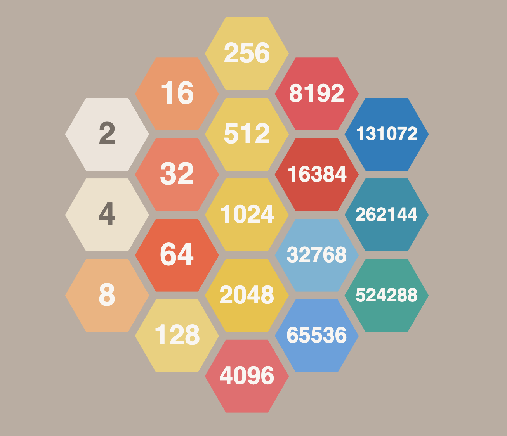

# Hexagonal 2048



## Description

This repository contains my submission to the [TypeScript Bootcamp](https://github.com/evolution-gaming/typescript-bootcamp) test task organized by [Evolution Gaming](https://eng.evolutiongaming.com/).

## Status

Looking at the requirements from the assignment page I would say that I managed to complete:

- [x] Have to render a game hexagonal field with hexagons according to the game size.
- [x] Required game size is 2. Existence of other game levels (3, 4, ...) is highly appreciated but NOT REQUIRED.
- [x] Have to receive data from the server and render them correctly.
- [x] Have to handle appropriate keyboard keys according to the rules.
- [x] Have to change field data by clicking keyboard keys according to the rules.
- [x] Deploy your implementation on the Internet (free resources: gh-pages, surge, netlify, vercel)
- [x] Have to work on the latest Google Chrome on the desktop (all other devices and browsers are up to you).
- [x] All other ideas, game features and controls, supported devices and so on are optional.

Extra credit requirements:

- [x] Support radiuses more than 2 (at least 3, 4 and even more)
- [ ] Cover your code base with unit tests (with a common sense of course)
- [ ] Implement animations

## Working with the code

```
git clone https://github.com/ksaveljev/hex2048.git
cd hex2048
yarn install         # install all dependencies
yarn build           # combine everything in dist/ folder
yarn test            # run unit tests
yarn run surge       # deploy to surge.sh
open dist/index.html # run the game locally
```

## Deployment

As was mentioned above I'm using [surge.sh](http://surge.sh) to deploy the game. You can play the game at [https://hex2048-ksaveljev.surge.sh](https://hex2048-ksaveljev.surge.sh/)
